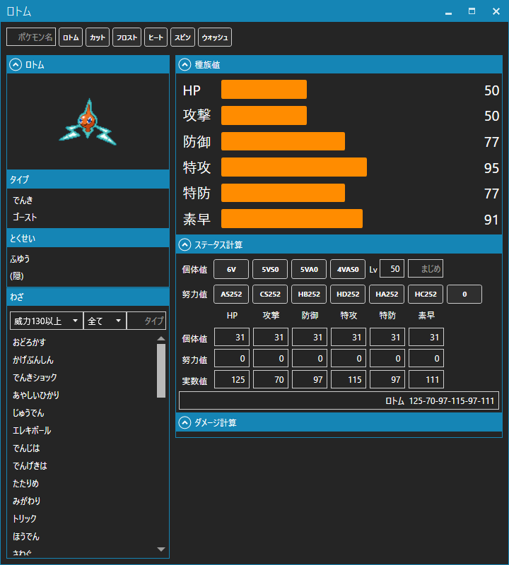

# PokeBrowser
## 概要
WPF + .Net Core3.1 の学習用のツールです。
ポケモンのデータを高速に検索するブラウザーとなっています。
データをWebスクレイピングで収集しているのでスクレイピングツールとスクレイプされたデータはリポジトリに含めません。

### 詳細ビュー(開発途中)
- 覚える技、種族値、タイプ、特性
- 個体値計算(対応中)
- ダメージ計算(対応予定)

### 検索ビュー(開発途中)
- 図鑑切り替え
- 任意文字列フィルタ( 名前、タイプ、とくせい、フォルム )  
- その他フィルタ(禁止級伝説,メガシンカ) , わざフィルタ(実装予定)
